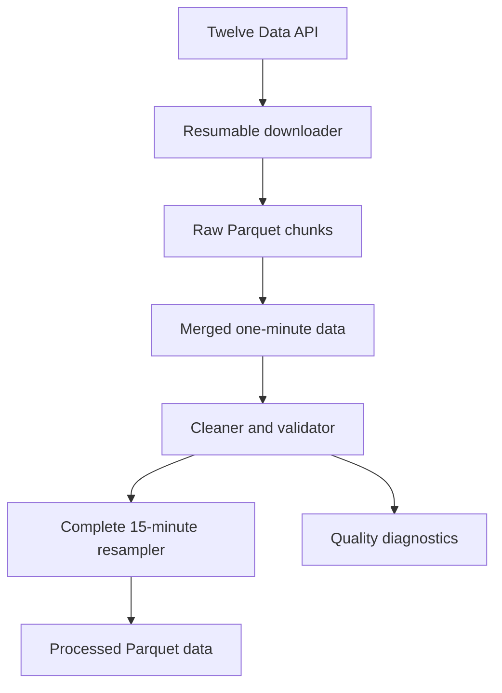

# Architecture

## Current processing flow

## Module responsibilities

| Path | Current responsibility |
| --- | --- |
| `config/settings.py` | Paths, timezones, API URL, timeout, and project parameters |
| `config/instruments.py` | Symbol metadata placeholders |
| `data_engine/loader.py` | Authentication, API requests, response validation, normalization, and saving |
| `data_engine/download_history.py` | Pagination, chunks, resumption, deduplication, and merging |
| `data_engine/cleaner.py` | Schema checks, UTC parsing, OHLC repair/rejection, sorting, and gaps |
| `data_engine/resampler.py` | One-minute to complete 15-minute aggregation |
| `data_engine/diagnose_quality.py` | Invalid-OHLC and timestamp-gap reports |
| `data_engine/inspect_invalid_magnitude.py` | OHLC violation-size diagnostics |
| `data_engine/validate_full_dataset.py` | Full validation and processed output |
| `tests/test_cleaner.py` | Cleaner unit tests |
| `tests/test_resampler.py` | Resampler unit tests |
| `main.py` | Logging and configuration smoke test |

## Placeholder areas

| Path | Status |
| --- | --- |
| `core/models.py` | Empty |
| `indicators/swings.py` | Empty |
| `strategy/` | Package placeholder |
| `execution/` | Package placeholder |
| `backtest/` | Package placeholder |

## Important design decisions

- UTC is the internal source-of-truth timezone.
- Missing candles are never fabricated.
- API secrets remain outside source control.
- Raw and processed datasets remain outside Git.
- One symbol is processed at a time.
- Chunks make long downloads resumable.
- Only 15-minute groups with 15 source candles are accepted by default.
- Automated tests protect deterministic transformations.
